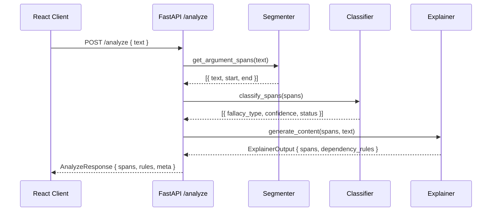

## Diagrams

<!-- PRIMARY comprehension surface. Reviewers should be able to grasp the full
change from the diagram(s) alone — Summary and code diff are supporting context,
not the primary explanation.

Use ```mermaid fenced blocks (GitHub renders them inline). Good shapes: state
machines, component trees, sequence diagrams, data flows, class diagrams.
Multiple diagrams are encouraged when the PR spans layers.

If the change genuinely cannot be diagrammed (one-line typo, dep bump,
config-only), write: N/A — <reason>


-->

## Summary

<!-- 1–3 bullets supporting the diagram(s) above. Lead with the *why* — the
diagram shows the *what*. -->

-
-

## Screenshots

<!-- REQUIRED when this PR adds or modifies visible UI. Otherwise write "N/A — not UI".

For subagent-generated PRs: capture via the dev server, commit under
docs/screenshots/taskN-<slug>/<description>.png, then reference using a
SHA-based raw.githubusercontent URL:

    SHA=$(git rev-parse HEAD)
    gh pr create --body "...  ..."

Human-authored PRs can drag-and-drop images directly into GitHub. -->

## Test plan

<!-- All boxes must be checked on a ready-to-merge PR. -->

- [ ] `cd backend && source .venv/bin/activate && pytest -v -m "not slow"` — green
- [ ] `cd frontend && npm test` — green
- [ ] `cd frontend && npx tsc --noEmit` — no type errors
- [ ] New tests added for any new behavior
- [ ] (UI only) Manual smoke via dev servers — feature works in the browser

---

🤖 Generated with [Claude Code](https://claude.com/claude-code)
