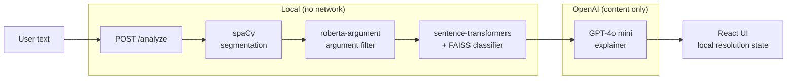

# fallacy-watch

Detects argument fallacies in pasted text using local NLP models — you resolve ambiguous cases, not a second LLM call.

[](https://github.com/julianken/fallacy-watch/actions/workflows/backend.yml)
[](https://github.com/julianken/fallacy-watch/actions/workflows/frontend.yml)
[](https://github.com/julianken/fallacy-watch/actions/workflows/e2e.yml)
[](https://www.repostatus.org/#wip)
[](LICENSE)

## What it does

fallacy-watch is a web app for spotting argument fallacies in any text you paste. Classification runs locally; only the explanation prose is generated by GPT-4o mini. When a finding sits below the confidence threshold, the app shows it as a question you answer rather than asking another model to decide. It is not a fact-checker and not content moderation.

## Quick start

**Prerequisites:** Python 3.11+, Node.js 20 LTS, ~4 GB free disk, ~10–15 minutes (mostly `pip install`).

Open two terminals. Backend first.

**Terminal 1 — backend:**

```bash
cd backend
python -m venv .venv && source .venv/bin/activate
pip install -r requirements.txt
python -m spacy download en_core_web_sm
uvicorn main:app --reload --port 8000
```

First analyze request downloads ~1 GB of model weights (cached after). Expect a pause on the first run.

> `OPENAI_API_KEY` is **optional**. Without it, explanation cards use template fallback content — the app still runs end-to-end. See [Configuration](#configuration) to enable GPT-4o mini explanations.

**Terminal 2 — frontend:**

```bash
cd frontend
npm install
npm run dev
```

Open <http://localhost:5173>, paste any argumentative text, click **Analyze**.

## How it works

An `/analyze` request runs four local stages — spaCy sentence segmentation, a `roberta-argument` filter, and a sentence-transformers + FAISS nearest-neighbor search that assigns each remaining span a fallacy type and a cosine-similarity confidence. Spans at or above 0.82 are marked `confirmed`; below, `possibly`. A single batched call to GPT-4o mini then produces explanation prose and the interactive challenge for each span; the OpenAI structured-output schema (`ExplainerSpan` in `backend/models/span.py`) has no `fallacy_type` field, so the model cannot return a classification. After analyze returns, every challenge resolution stays in the React `useFallacyCollection` hook with no further server calls.



See the [design spec](docs/specs/2026-04-17-fallacy-watch-design.md) for the schema, cascade rules, and confidence-threshold rationale.

## Project structure

```text
backend/        FastAPI app + NLP pipeline
  data/         Pre-built FAISS index + labels
  pipeline/     Segmenter, filter, classifier, explainer
frontend/       React + TypeScript + Vite SPA
  src/hooks/    useFallacyCollection cascade logic
e2e/            Playwright specs (auto-starts on :5174)
docs/
  specs/        Design spec — schema and cascade rules
  plans/        Implementation plans by issue
```

## Configuration

`OPENAI_API_KEY` is the only environment variable. To enable GPT-4o mini explanations, create `backend/.env`:

```bash
echo "OPENAI_API_KEY=sk-..." > backend/.env
```

> [!NOTE]
> When `OPENAI_API_KEY` is missing or invalid, every span gets template fallback content and the response still returns 200. Classification is unaffected.

All other knobs — confidence threshold (`0.82`), max input length (`20_000` chars), OpenAI model name, batch sizes, CORS origin — are constants in `backend/pipeline/` and `backend/main.py`. CORS is hardcoded to `http://localhost:5173`; the app is dev-only. The full table lives in [docs/specs/2026-04-17-fallacy-watch-design.md](docs/specs/2026-04-17-fallacy-watch-design.md).

## Tests

```bash
cd backend && source .venv/bin/activate && pytest -v   # unit + integration
cd frontend && npx vitest run                          # type-check via tsc, then vitest --passWithNoTests
cd e2e && npm install && npx playwright install --with-deps chromium && npm test   # requires backend on :8000
```

CI runs all three on every PR (see badges above). E2E shards 4-way and auto-starts the frontend on port 5174.

## Documentation

- [Design spec](docs/specs/2026-04-17-fallacy-watch-design.md) — schema, cascade rules, confidence-threshold rationale.
- [PR template](.github/PULL_REQUEST_TEMPLATE.md) — required sections (Diagrams, Summary, Screenshots, Test plan, Plan reference).
- [CLAUDE.md](CLAUDE.md) — orientation for AI-assisted contributors.

## License

[MIT](LICENSE) © Julian Kennon
